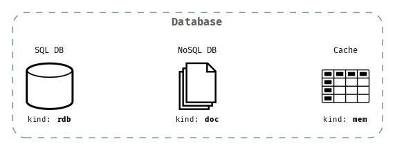

# Draft

[](https://goreportcard.com/report/github.com/lucasepe/draft) &nbsp;&nbsp;&nbsp; 

A commandline tool that generate **H**igh **L**evel microservice & serverless **A**rchitecture diagrams using a declarative syntax defined in a YAML file.

- Works on [linux, macOS, windows](https://github.com/lucasepe/draft/releases/latest)
- Just a [single portable binary file](https://github.com/lucasepe/draft/releases/latest)
- It Does One Thing Well
- Input data in flat YAML text files
- Usable with shell scripts

## How `draft` works?

`draft` takes in input a declarative YAML file and generates a [`dot`](https://en.wikipedia.org/wiki/DOT_(graph_description_language)) script for [Graphviz](https://www.graphviz.org/)

```bash
draft backend-for-frontend.yml | dot -Tpng -Gdpi=200 > backend-for-frontend.png 
```

Piping the `draft` output to [GraphViz](http://www.graphviz.org/doc/info/output.html/) `dot` you can generate the following output formats:

| format       | command                                                        |
|:-------------|:---------------------------------------------------------------|
| GIF          | <code>draft input.yml &#124; dot -Tgif > output.gif</code>     |
| JPEG         | <code>draft input.yml &#124; dot -Tjpg > output.jpg</code>     |
| PostScript   | <code>draft input.yml &#124; dot -Tps > output.ps</code>       |
| PSD          | <code>draft input.yml &#124; dot -Tpsd > output.psd</code>     |
| SVG          | <code>draft input.yml &#124; dot -Tsvg > output.svg</code>     |
| WebP         | <code>draft input.yml &#124; dot -Twebp > output.webp</code>   |

To install GraphViz to your favorite OS, please, follow this link [https://graphviz.gitlab.io/download/](https://graphviz.gitlab.io/download/).

## Components

> a picture is worth a thousand words 

... and this is particularly true in regard to complex IT architectures. 

The basic unit of each _draft_ design is the `component`:

```go
type Component struct {
  ID        string `yaml:"id,omitempty"`        // optional - autogenerated if omitted (read more for details...)
  Kind      string `yaml:"kind"`                // required - see the table below
  Label     string `yaml:"label,omitempty"`     // optional - works only for: 'queue', 'service', 'storage', 'function', 'database', 'client'  
  Provider  string `yaml:"provider,omitempty"`  // optional - you can use this to specify the cloud provider
  Impl      string `yaml:"impl,omitempty"`      // optional - you can use this to specify the implementation
  FillColor string `yaml:"fillColor,omitempty"` // optional - the hex code for the background color 
  FontColor string `yaml:"fontColor,omitempty"` // optional - the hex code for the foreground color
  Rounded   bool   `yaml:"rounded,omitempty"`   // optional - set to true if you wants rounded shapes
}
```

Draft uses a set of symbols independent from the different providers (AWS, Microsoft Azure, GCP).

Eventually you can describe...

- the implementation using the `impl` attribute (ie: _impl: 'SQS'_)
- the cloud provider using the `provider` attribute (ie: _provider: AWS_)
  - 💡 components with the same provider will be 'grouped'

Below is a list of all the components currently implemented.

| Component             | Kind        | YAML                                                          | Output                            |
|:----------------------|:------------|:--------------------------------------------------------------|:---------------------------------:|
| **Client**            | `client`    | 👉 [examples/client.yml](./examples/client.yml)               |         |
| **Microservice**      | `service`   | 👉 [examples/service.yml](./examples/service.yml)             |        |
| **Gateway**           | `gateway`   | 👉 [examples/gateway.yml](./examples/gateway.yml)             |        |
| **Firewall**          | `waf`       | 👉 [examples/waf.yml](./examples/waf.yml)                     |            |
| **Container Service** | `cos`       | 👉 [examples/waf.yml](./examples/cos.yml)                     |            |
| **Message Broker**    | `broker`    | 👉 [examples/broker.yml](./examples/broker.yml)               |         |
| **Queue Service**     | `queue`     | 👉 [examples/queue.yml](./examples/queue.yml)                 |          |
| **Object Storage**    | `storage`   | 👉 [examples/storage.yml](./examples/storage.yml)             |        |
| **Function**          | `function`  | 👉 [examples/function.yml](./examples/function.yml)           |       |
| **Database**          | `database`  | 👉 [examples/database.yml](./examples/database.yml)           |       |
| **Load Balancer**     | `balancer`  | 👉 [examples/balancer.yml](./examples/balancer.yml)           |       |
| **CDN**               | `cdn`       | 👉 [examples/cdn.yml](./examples/cdn.yml)                     |            |
| **DNS**               | `dns`       | 👉 [examples/dns.yml](./examples/dns.yml)                     |            |
| **Custom Html**       | `html`      | 👉 [examples/custom_image.yml](./examples/custom_image.yml)   |   |

For custom HTML components (_kind: html_) only these tags are supported:

- `<b>`, `<br/>`, `<font>`, `<hr>`, `<i>`, ` (in <td>…</td> only)`
- `<o>`, `<s>`, `<sub>`, `<sup>`, `<table>`, `<tr>`, `<u>`

### Notes about a component `id`

- you can define your component `id` explicitly (i.e. _id: MY_SERVICE_A_)
- or you can omit the component `id` attribute and it will be autogenerated

#### How is auto-generated a component `id`?

An auto-generated component `id` has a prefix and a sequential number

- the prefix is related to the component `kind`

| a kind of... | will generate an `id` prefix with... | example          | 
|:-------------|:-------------------------------------|:-----------------|
| `client`     | cl                                   | _cl1, cl2,..._   |
| `service`    | ms                                   | _ms1, ms2,..._   |
| `gateway`    | gt                                   | _gt1, gt2,..._   |
| `gateway`    | waf                                  | _waf1, waf2,..._ |
| `broker`     | br                                   | _br1, br2,..._   |
| `queue`      | qs                                   | _qs1, qs2,..._   |
| `storage`    | st                                   | _st1, st2,..._   |
| `function`   | fn                                   | _fn1, fn2,..._   |
| `database`   | db                                   | _db1, db2,..._   |
| `balancer`   | lb                                   | _lb1, lb2,..._   |
| `cdn`        | cn                                   | _cn1, cn2,..._   |
| `dns`        | dn                                   | _dn1, dn2,..._   |
| `html`       | htm                                  | _htm1, htm2,..._ |            
| `cos`        | cos                                  | _cos1, cos2,..._ |   

## Connections

You can connect each component by arrows.

To be able to connect an _origin component_ with one or more _target component_ you need to specify each `componentId`.

A `connection` has the following properties:

```go
type Connection struct {
  Origin struct {
    ComponentID string `yaml:"componentId"`
  } `yaml:"origin"`
  Targets []struct {
    ComponentID string `yaml:"componentId"`
    Label       string `yaml:"label,omitempty"`
    Color       string `yaml:"color,omitempty"`
    Dashed      bool   `yaml:"dashed,omitempty"`
    Dir         string `yaml:"dir,omitempty"`
    Highlight   bool   `yaml:"highlight,omitempty"`
  } `yaml:"targets"`
}
```

---

## Changelog

👉 [Record of all notable changes made to a project](./CHANGELOG.md)

---

## Examples

👉 [Collection of draft architecture descriptor YAML files](./examples/README.md)

---

(c) 2020 Luca Sepe http://lucasepe.it. MIT License
