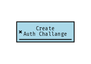

# Draft

A commandline tool that generate **H**igh **L**evel microservice & serverless **A**rchitecture diagrams using a declarative syntax defined in a YAML file.

- Works on Linux, Mac OSX, Windows
- Just a single portable binary file
- It Does One Thing Well
- Input data in flat YAML text files
- Usable with shell scripts

## How `draft` works?

`draft` takes in input a declarative YAML file and generates a [`dot`](https://en.wikipedia.org/wiki/DOT_(graph_description_language)) script for [Graphviz](https://www.graphviz.org/)

```bash
draft backend-for-frontend.yml | dot -Tpng -Gdpi=200 > backend-for-frontend.png 
```

Piping the `draft` output to [GraphViz](http://www.graphviz.org/doc/info/output.html/) `dot` you can generate the following output formats:

| format       | command                                                        |
|:-------------|:---------------------------------------------------------------|
| GIF          | <code>draft input.yml &#124; dot -Tgif > output.gif</code>     |
| JPEG         | <code>draft input.yml &#124; dot -Tjpg > output.jpg</code>     |
| PostScript   | <code>draft input.yml &#124; dot -Tps > output.ps</code>       |
| PSD          | <code>draft input.yml &#124; dot -Tpsd > output.psd</code>     |
| SVG          | <code>draft input.yml &#124; dot -Tsvg > output.svg</code>     |
| WebP         | <code>draft input.yml &#124; dot -Twebp > output.webp</code>   |

To install GraphViz to your favorite OS, please, follow this link [https://graphviz.gitlab.io/download/](https://graphviz.gitlab.io/download/).

## Components

### A picture is worth a thousand words 

... and this is particularly true in regard to complex IT architectures. 

The basic unit of each _draft_ design is the `component`:

```go
type Component struct {
	ID        string `yaml:"id,omitempty"`        // optional - autogenerated if omitted (read more for details...)
	Kind      string `yaml:"kind"`                // required (one of: service, gateway, queue, broker, function, storage, database)
	Label     string `yaml:"label,omitempty"`     // optional - the component description (or scope)  
	Provider  string `yaml:"provider,omitempty"`  // optional - you can use this to specify the implementation
	FillColor string `yaml:"fillColor,omitempty"` // optional - the hex code for the background color 
	FontColor string `yaml:"fontColor,omitempty"` // optional - the hex code for the foreground color
	Rounded   bool   `yaml:"rounded,omitempty"`   // optional - set to true if you wants rounded shapes
}
```

Draft uses a set of symbols independent from the different providers (AWS, Microsoft Azure, GCP).

- you can eventually describe the implementation using the `provider` attribute.

Below is a list of all the components currently implemented.

| Component          | Kind        | YAML                      | Output                           |
|:-------------------|:------------|:--------------------------|:--------------------------------:|
| **Client**         | `client`    |     |        |
| **Microservice**   | `service`   |     |       |
| **Gateway**        | `gateway`   |     |       |
| **Message Broker** | `broker`    |     |        |
| **Queue Service**  | `queue`     |     |         |
| **Object Storage** | `storage`   |     |       |
| **Function**       | `function`  |     |      |
| **Database**       | `database`  |     |      |

## Connections

You can connect each component by arrows.

To be able to connect an _origin component_ with one or more _target component_ you need to specify each `componentId`.

- you can define your component `id` explicitly
- you can omit the component `id` attribute and it will be autogenerated

### Autogenerated `id`

An autogenerated `id` has a prefix and a sequential number

- the prefix is related to the component `kind`

Aautogenerated `id` prefix mapping.

| a kind of... | will generate an `id` prefix with... | examples       |
|:-------------|:-------------------------------------|:---------------|
| `client`     | `cl`                                 | `cl1, cl2,...` |
| `service`    | `ms`                                 | `ms1, ms2,...` |
| `gateway`    | `gt`                                 | `gt1, gt2,...` |
| `broker`     | `br`                                 | `br1, br2,...` |
| `queue`      | `qs`                                 | `qs1, qs2,...` |
| `storage`    | `st`                                 | `st1, st2,...` |
| `function`   | `fn`                                 | `fn1, fn2,...` |
| `database`   | `db`                                 | `db1, db2,...` |

A `connection` has the following properties:

```go
type Connection struct {
	Origin struct {
		ComponentID string `yaml:"componentId"`
	} `yaml:"origin"`
	Targets []struct {
		ComponentID string `yaml:"componentId"`
		Label       string `yaml:"label,omitempty"`
		Color       string `yaml:"color,omitempty"`
		Dashed      bool   `yaml:"dashed,omitempty"`
    Dir         string `yaml:"dir,omitempty"`
    Highlight   bool   `yaml:"highlight,omitempty"`
	} `yaml:"targets"`
}
```

## Example 1 - Message Bus Pattern

Create the `draft` architecture descriptor YAML with your favorite editor:

```yaml
title: message bus pattern 
backgroundColor: '#ffffff'
components:
  - 
    kind: service
    label: Producer
    provider: AWS EC2
  -
    kind: broker
    label: "Notification\nService"
    provider: AWS SNS
  -
    kind: queue
    label: "event queue @ topic 1"
    provider: AWS SQS
  -
    kind: queue
    label: "event queue @ topic 2"
    provider: AWS SQS
  -
    kind: service
    label: "Consumer\n@ topic 1"
    provider: AWS EC2
  -
    kind: service
    label: "Consumer\n@ topic 2"
    provider: AWS EC2
connections:
  -
    origin: 
      componentId: ms1
    targets:
      -
        componentId: br1
  -
    origin:
      componentId: br1
    targets:
      -
        componentId: qs1
        dashed: true
      -
        componentId: qs2
        dashed: true
  -
    origin:
      componentId: qs1
    targets:
      -
        componentId: ms2
        dir: back
  -
    origin: 
      componentId: qs2
    targets:
      -
        componentId: ms3
        dir: back
```

Then run `draft`:

```bash
draft message-bus-pattern.yml | dot -Tpng > message-bus-pattern.png
```

Here the generated output:


## Example 2 - AWS Cognito Custom Authentication Flow

Create the draft architecture descriptor YAML with your favorite editor:

```yaml
title: Amazon Cognito Custom Authentication Flow with external database
backgroundColor: '#ffffff'
components:
  -
    kind: client
    label: "Web App"
  -
    kind: client
    label: "Mobile App"
  -
    kind: service
    label: "Cognito"
    provider: "AWS Cognito"
    fillColor: '#991919'
    fontColor: '#fafafa'
  -
    kind: function
    label: "Define\nAuthChallange"
    provider: "AWS Lambda"
  -
    kind: function
    label: "Create\nAuthChallange"
    provider: "AWS Lambda"
  -
    kind: function
    label: "Verify\nAuthChallange"
    provider: "AWS Lambda"
  -
    kind: database
    label: "Users\nRepository"
    provider: "AWS RDS"
connections:
  -
    origin:
      componentId: cl1
    targets:
      -
        componentId: ms1
  -
    origin:
      componentId: cl2
    targets:
      -
        componentId: ms1
  -
    origin:
      componentId: ms1
    targets:
      -
        componentId: fn1
      -
        componentId: fn2
      -
        componentId: fn3
  -
    origin:
      componentId: fn2
    targets:
      -
        componentId: db1
```

Here the generated output:


